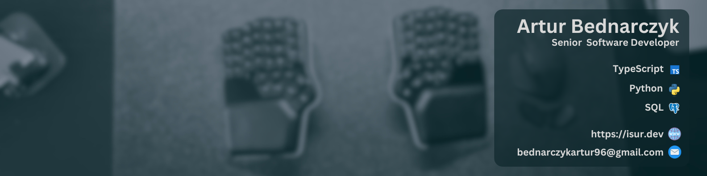
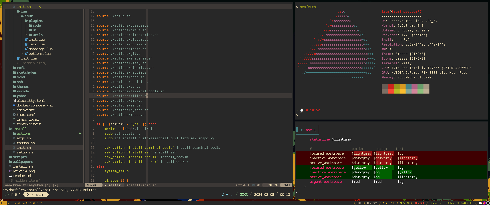
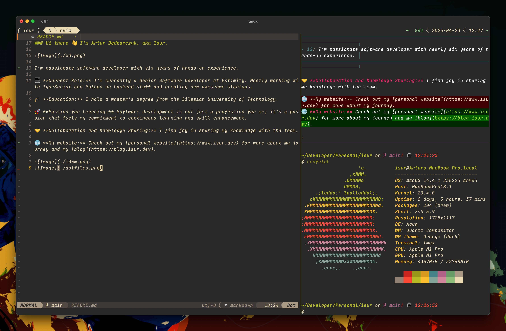

### Hi there 👋 I'm Artur Bednarczyk, aka Isur.

I'm passionate software developer with six years of hands-on experience.

💻 **Current Role:** I'm currently a Senior Software Developer at Estimity. Mostly working with TypeScript and Python on backend stuff and creating new aweseome startups.

🎓 **Education:** I hold a master's degree from the Silesian University of Technology.

🚀 **Passion for Learning:** Software development is not just a profession for me; it's a passion that fuels my commitment to continuous learning and skill enhancement.

🤝 **Collaboration and Knowledge Sharing:** I find joy in sharing my knowledge with the team.

🌐 **My website:** Check out my [personal website](https://www.isur.dev) for more about my journey and my [blog](https://blog.isur.dev).

